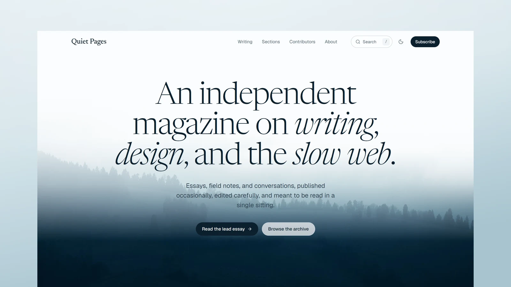

# Quiet Pages - Astro Magazine Theme

[](https://quietpages.xocoweb.workers.dev/)

[](https://astro.build/)
[](https://tailwindcss.com/)
[](https://www.typescriptlang.org/)
[](./LICENSE)

**Live preview:** https://quietpages.xocoweb.workers.dev/

Quiet Pages is a free Astro theme for independent magazines, personal journals, and long-form writing. It pairs a calm, misty photographic hero and a serif reading column with the tools a publication needs, so the writing stays the focus. Posts are MDX files validated by Astro content collections, the settings live in a few config files, and the output is fully static.

## Features

- A homepage with a full-bleed photo hero, a lead essay, the latest writing with a section filter, and section tiles
- Posts written in MDX, one folder per post with its cover beside it, with sections, tags, and authors checked against the config at build time
- A `Ctrl/⌘ + K` search palette on every page, with the most recent posts before the first keystroke
- An archive of cards that searches as you type across titles, excerpts, sections, tags, and authors, with section and tag filters kept in the URL
- Article pages with a byline, a wide lead image with its photo credit, a serif reading column, and an "On this page" rail
- A share sheet with X, LinkedIn, Facebook, email, WhatsApp, Telegram, Threads, Bluesky, Mastodon, Reddit, and Pinterest plus a copy-link field, an author note, previous and next cards, and "Keep reading" suggestions
- Images dropped into a post with plain Markdown, an optional `Figure` with caption and credit, and a lightbox with arrows, swipe, and keyboard support
- Syntax highlighting with light and dark themes and a copy button on every code block
- Sections, Tags, and Contributors index pages, plus a page for every section, tag, and author
- Author pages with a portrait, role, bio, and everything they have published
- A subscribe panel above the footer, and newsletter and contact forms that run in demo mode until you add an endpoint
- About, Contact, and a designed 404 page
- Light and dark modes that follow the system until a reader picks one, applied before first paint
- A header that hides while you scroll down and returns solid on the way up, a mobile menu, a reading progress bar, and a skip link
- Entrance motion in CSS only, switched off for reduced-motion users
- Responsive, optimized images through Astro's image pipeline, with social cards cropped from each post's cover
- RSS, sitemap, `robots.txt`, canonical URLs, Open Graph and Twitter/X cards, and JSON-LD for the site, posts, collections, profiles, and breadcrumbs
- Self-hosted Newsreader, Geist, and Geist Mono, a local Lucide icon set, and design tokens in one stylesheet
- Static output with no framework islands and only a few small scripts
- Landmarks, labelled controls, visible focus states, and keyboard support throughout

## Tech Stack

- Astro 7 with MDX
- Tailwind CSS 4 via the Vite plugin
- TypeScript, Astro content collections
- `@astrojs/sitemap`, `@astrojs/rss`, Sharp
- Self-hosted Newsreader, Geist, and Geist Mono, Lucide and Bootstrap Icons, each with its license notice

## Requirements

- Node.js `22.12.0` or newer
- npm

## Getting Started

```bash
npm install
npm run dev
```

Build for production:

```bash
npm run build
```

Preview the production build locally:

```bash
npm run preview
```

Before shipping a change, run type checking, the production build, and the formatter check together:

```bash
npm run release:check
```

## Customization

See [CUSTOMIZATION.md](./CUSTOMIZATION.md) for site settings, authors, sections and tags, posts and their frontmatter, the homepage and its hero image, search and the archive, article pages, forms, the theme's design tokens, fonts, icons, and dark mode.

Set `siteConfig.siteUrl` in [src/config/site.ts](./src/config/site.ts) before building — canonical URLs, social images, the sitemap, the RSS feed, `robots.txt`, and the structured data are all derived from it. The build is static, so any host that serves a directory works: `vercel.json` is included for Vercel and `wrangler.jsonc` for Cloudflare Workers, and Netlify, GitHub Pages, and object storage behind a CDN need no configuration beyond `npm run build`.

## Content

Posts live in [src/content/blog](./src/content/blog), one folder per post holding an `index.mdx` and its cover image, validated by the schema in [src/content.config.ts](./src/content.config.ts). The folder name is the post's URL slug, and its `category`, `tags`, and `author` must match entries in [src/config/taxonomy.ts](./src/config/taxonomy.ts) and [src/config/authors.ts](./src/config/authors.ts).

The bundled posts and contributors are fictional demo content. The author portraits are Pexels stock photos unrelated to the names they illustrate, and the cover images come from Unsplash, credited in each post's frontmatter. Replace them, and the homepage photograph, with your own writing, people, and photographs before launch.

## Support

Quiet Pages is free and provided as-is. Bug reports and questions are welcome as [GitHub issues](https://github.com/xocothemes/quietpages/issues); custom design and feature work is not included. See [CONTRIBUTING.md](./CONTRIBUTING.md) to propose a change, and [CHANGELOG.md](./CHANGELOG.md) for release history.

## License

MIT — free for personal and commercial projects. See [LICENSE](./LICENSE), which also lists the licenses of the bundled fonts and icons.

## Credits

- [Newsreader](https://github.com/productiontype/Newsreader) by Production Type, under the SIL Open Font License
- [Geist and Geist Mono](https://github.com/vercel/geist-font) by Vercel, under the SIL Open Font License
- [Lucide](https://lucide.dev/), under the ISC License
- [Bootstrap Icons](https://icons.getbootstrap.com/), under the MIT License
- Photography from [Unsplash](https://unsplash.com/) and [Pexels](https://www.pexels.com/)
